<head>
  <meta name="twitter:url" 
    content="https://azure.github.io/Cloud-Native/blog/functions-1" />
  <meta name="twitter:title" 
    content="#30DaysOfServerless: Azure Functions Fundamentals" />
  <meta name="twitter:description" 
    content="#30DaysOfServerless: Azure Functions Fundamentals" />
  <meta name="twitter:image"
    content="https://azure.github.io/Cloud-Native/img/banners/post-kickoff.png" />
  <meta name="twitter:card" content="summary_large_image" />
  <meta name="twitter:creator" 
    content="@nitya" />
  <meta name="twitter:site" content="@AzureAdvocates" /> 
  <link rel="canonical" 
    href="https://azure.github.io/Cloud-Native/blog/06-functions-dotnet" />
</head>

---

Welcome to `Day 6` of #30DaysOfServerless!

The theme for this week is Azure Functions. We'll talk about ...

---

## What We'll Cover

 * Azure Functions and Serverless explained.
 * Exercise: Provision a new Functions App.
 * Exercise: Creating a Function with a HTTP trigger.
 * Resources: For self-study!


---


## Azure Functions and Serverless explained.

Azure Functions is a serverless compute service that enables you to run code on-demand without explicitly provisioning or managing the underlying infrastructure. 

Developing code that will run in a serverless environment departs from the traditional ASP.NET WebAPI technique of creating controllers with actions. Instead, as the name implies, we make functions as small snippets of functionality. An Azure Function persists these code snippets and meta-information concerning when and how it should get executed. The function sleeps until it has been invoked by a trigger, which wakes it up, runs the code snippet and returns to sleep.

This behaviour allows for a very attractive pricing model where you only pay for the execution time of an Azure Function. If you write code that never gets executed, it won't cost you anything! That means you only pay and Azure Function when it is actually used.

## Provision a new Functions App.

Multiple Azure Functions are hosted in a Function App. To create one, in the Azure Portal, search for Function App.
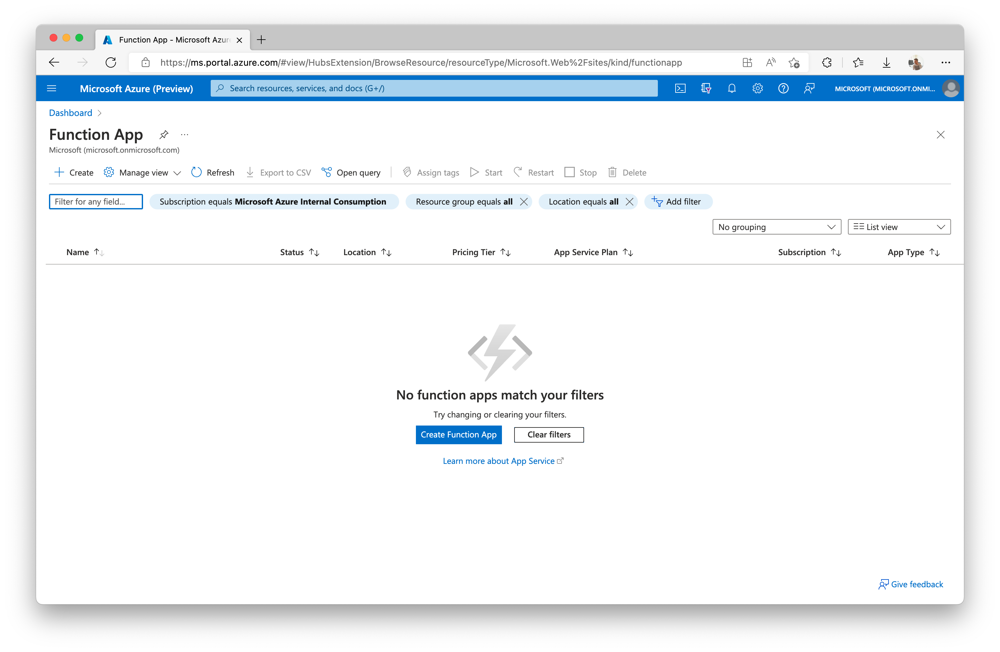

We need to provide a resource group for the function (which is a logical container for grouping services). Given that we're only going to deploy a single service, it dones't matter what we call this. 

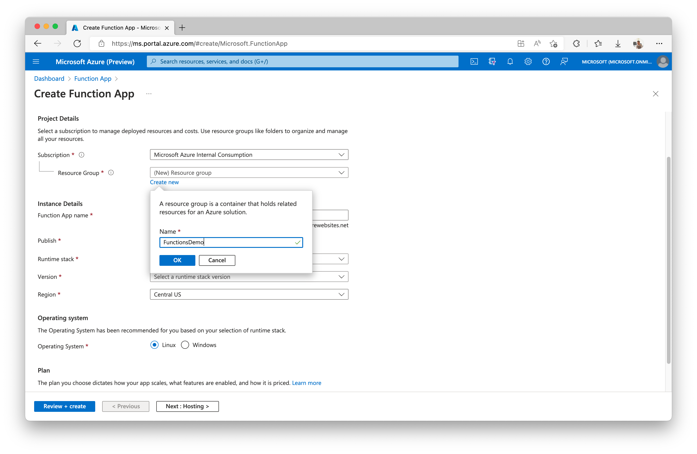

Next up is to provide a name, which becomes part of the Function Apps URL. Because of this, you'll need to ensure that the Function App name is unique. The portal will show you a green tick in the name textbox when you provide a usable and unique name. 

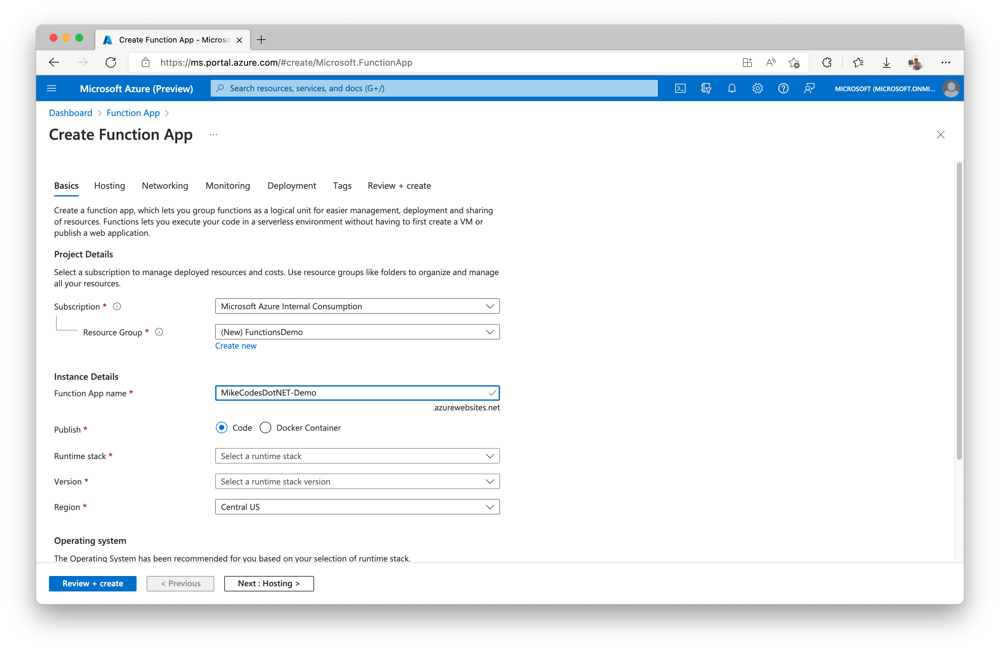


In the interest of brevity and simplicity, let's use the following values for the rest of the configuration:

- **Publish:** Code
- **Runtime stack:** .NET
- **Version:** 6
- **Region:** Closest to you.
- **Operating System:** Windows or Linux
- **Plan type:** Consumption (Serverless)

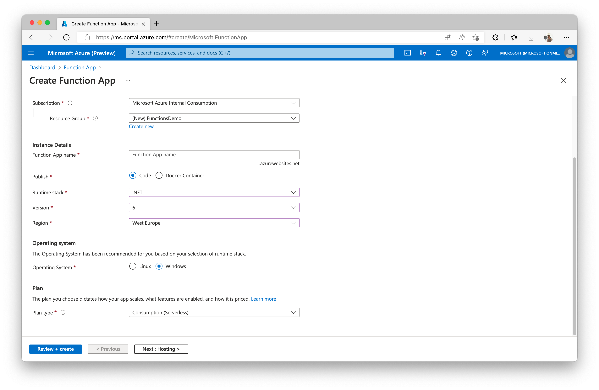

Clicking the ***Review + Create*** button will then then take you a view where you can confirm the configuration. You should then click the ***Create*** button. 
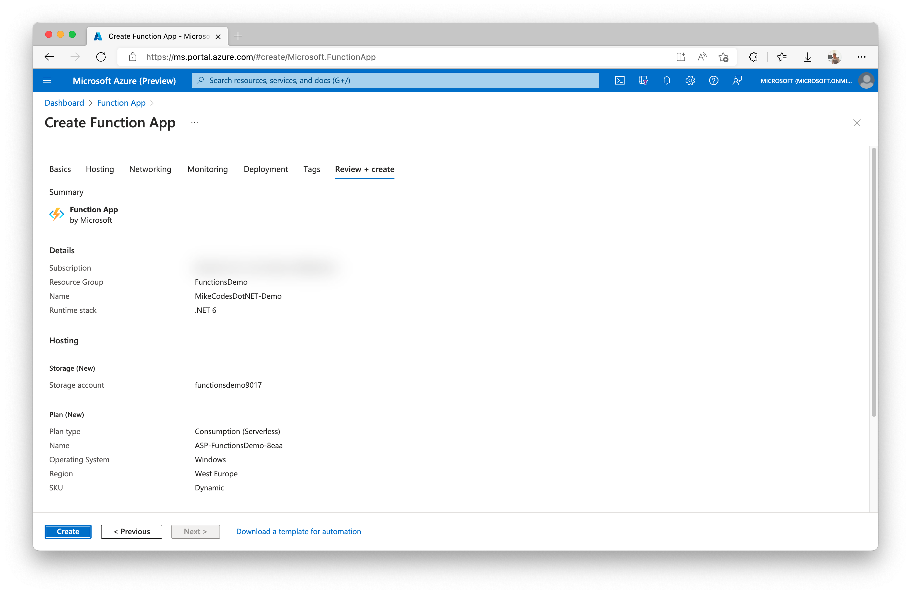

This kicks off the creation of the new Functions App in your selected region. It should only take ~30 second to before the deployment finishes and you can start using it.

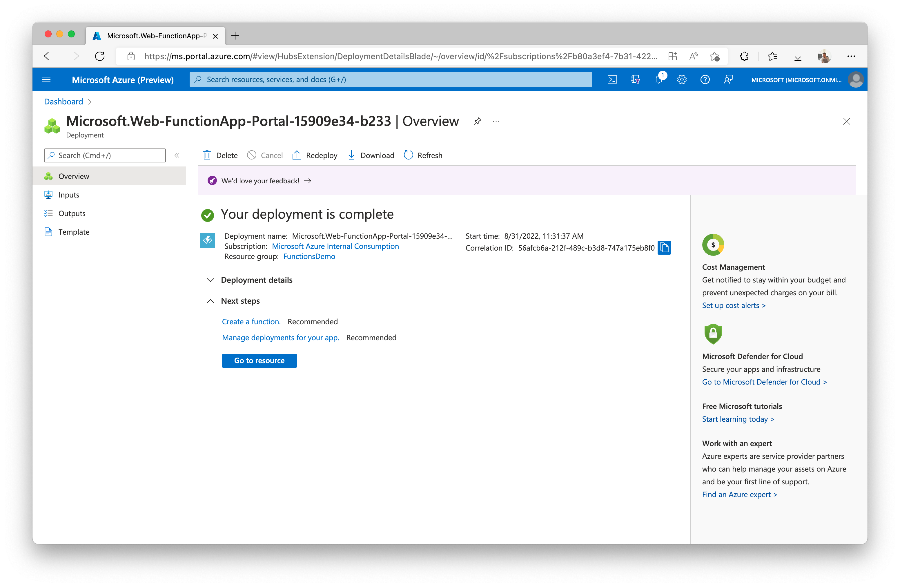

Once the deployment has completed, clicking the ***Go To Resource*** button will take you to the dashboard of the new Function App. 


You should find a section named Functions in the menu on the furthest left of the portal. Within this section, you should click on the ***Functions*** item to navigate to the list of Functions that exist within this Functions App. Right now, that's zero, but we're going to create our first function next.

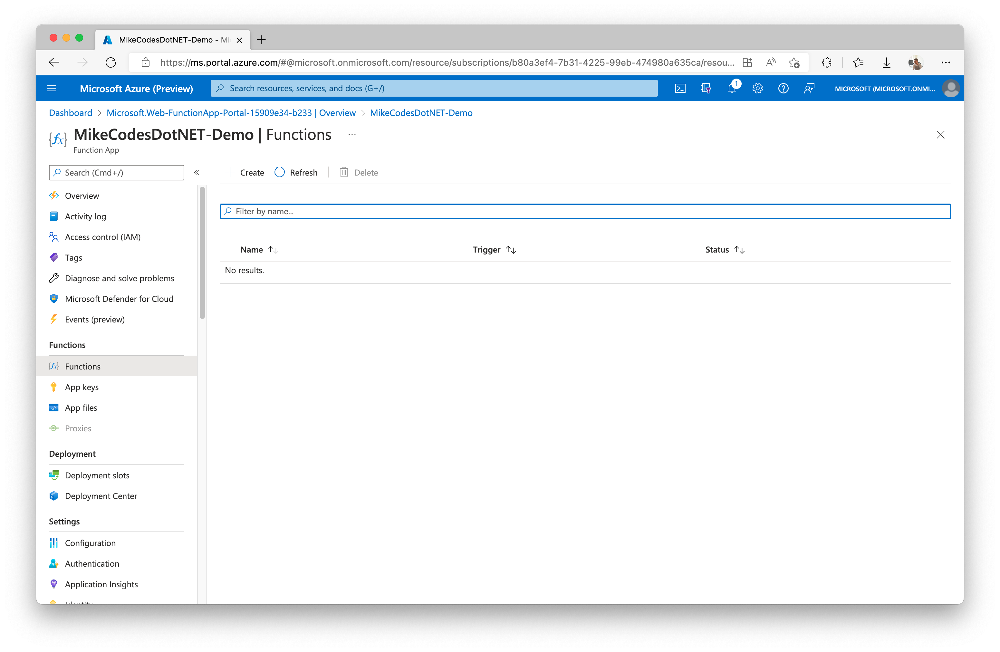

## Creating a Function with a HTTP trigger.

Now that we have an empty Functions App let's go ahead and create our first Function. The simplest is a Function that we trigger via an HTTP request.

To create a new Function, click on the ***Create*** button. 

### Tooling 

We can write our Function in various ways, with most developers sensibly opting to use their favourite IDEs such as Visual Studio and Visual Studio Code with the [Azure Functions extension](https://marketplace.visualstudio.com/items?itemName=ms-azuretools.vscode-azurefunctions). In the interest of simplicity, we'll opt for the built-in portal editor as it provides the fastest way to get started! 

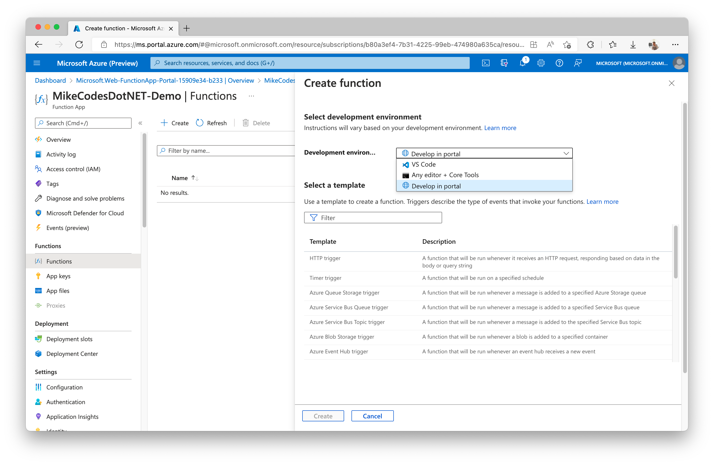

### Triggers 

As previously mentioned, Azure Functions are based on the concept of **Triggers**, which define when a Function should wake up and execute its code. There are several different [Trigger Bindings](https://docs.microsoft.com/en-us/azure/azure-functions/functions-triggers-bindings) that can be defined in the function's source code or configuration files. Our first function uses the [HTTP Binding](https://docs.microsoft.com/en-us/azure/azure-functions/functions-bindings-http-webhook?tabs=in-process%2Cfunctionsv2&pivots=programming-language-csharp) as a Trigger so it wakes up whenever it recieves a HTTP request. 

We will use the provided HTTP trigger template to jump-start our development. Once you've selected ***HTTP Trigger***, click the ***Create*** button. 

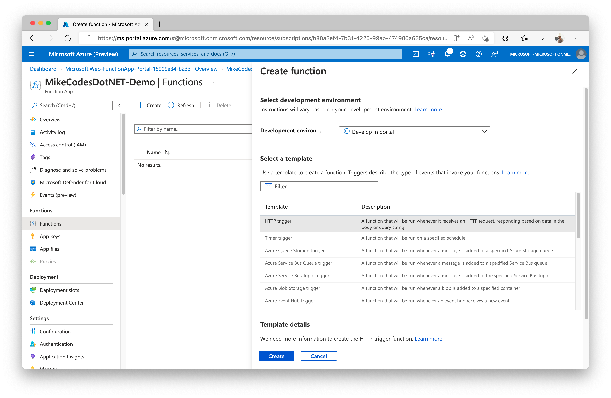

You should now have an new HTTP Trigger and seethe HttpTrigger1 ***Overview*** view displayed. This gives you an snapshot into how often the Function is being executed (woken up) as well as understanding if it's failing.

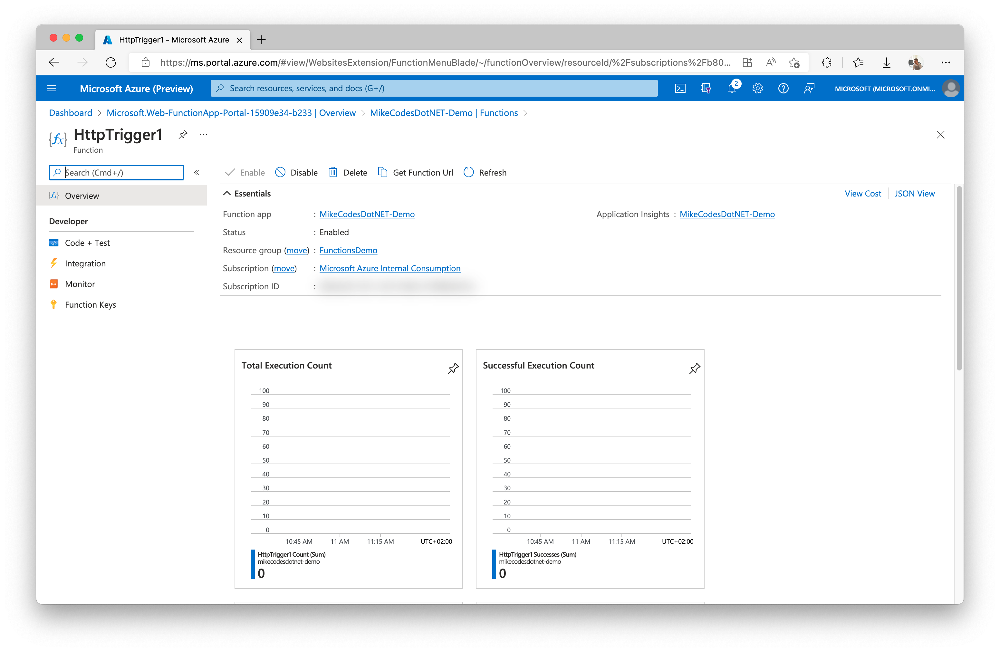


To start editing the code, click on the ***Code + Test*** menu item, found within the ***Developer*** section of the left-side menu. 

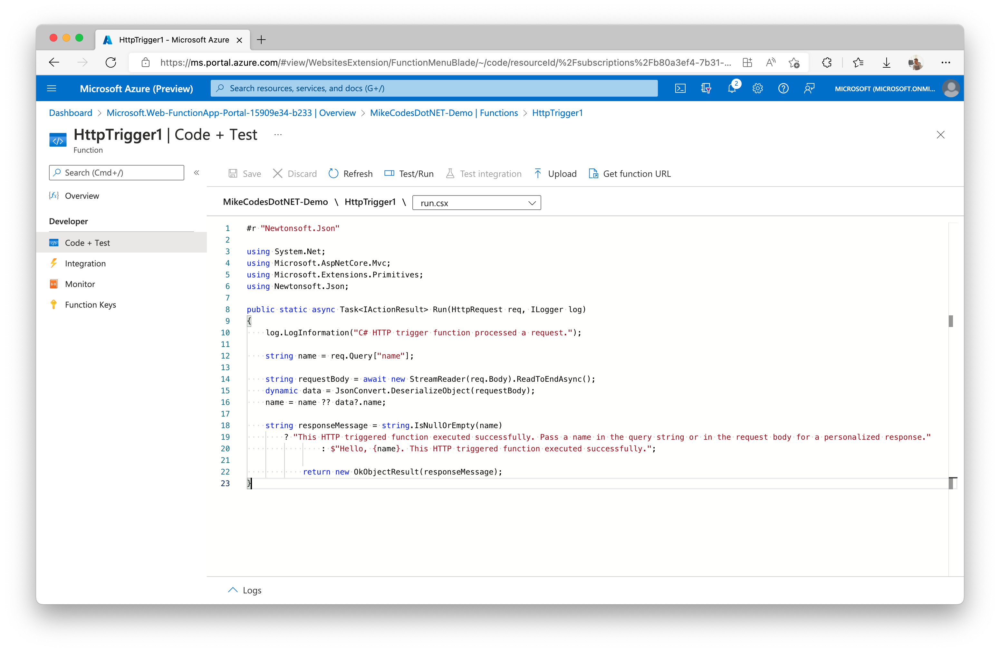

A few interesting things are happening within this snippet. 

Firstly the file extension is ***.csx***, which is a C# Script. Secondly, because it's a script, the Nuget package import is defined using ```#r "PACKAGE_NAME"``` format. 

```csharp
#r "Newtonsoft.Json"

using System.Net;
using Microsoft.AspNetCore.Mvc;
using Microsoft.Extensions.Primitives;
using Newtonsoft.Json;

public static async Task<IActionResult> Run(HttpRequest req, ILogger log)
{
    log.LogInformation("C# HTTP trigger function processed a request.");

    string name = req.Query["name"];

    string requestBody = await new StreamReader(req.Body).ReadToEndAsync();
    dynamic data = JsonConvert.DeserializeObject(requestBody);
    name = name ?? data?.name;

    string responseMessage = string.IsNullOrEmpty(name)
        ? "This HTTP triggered function executed successfully. Pass a name in the query string or in the request body for a personalized response."
                : $"Hello, {name}. This HTTP triggered function executed successfully.";

            return new OkObjectResult(responseMessage);
}
```

The script is ready to run and we can test it by clicking the ***Test/Run*** button above the code editor. This is will present a slide-over view enabling you to send a HTTP request to the function.

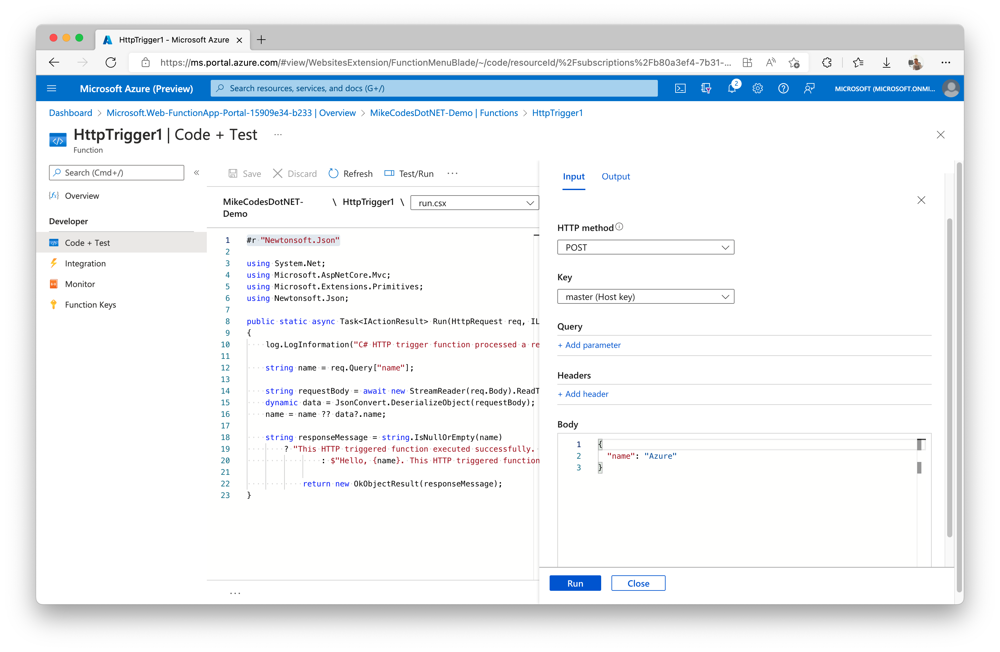

Clicking the ***Run*** button will then send the HTTP request and automatically display the response. 

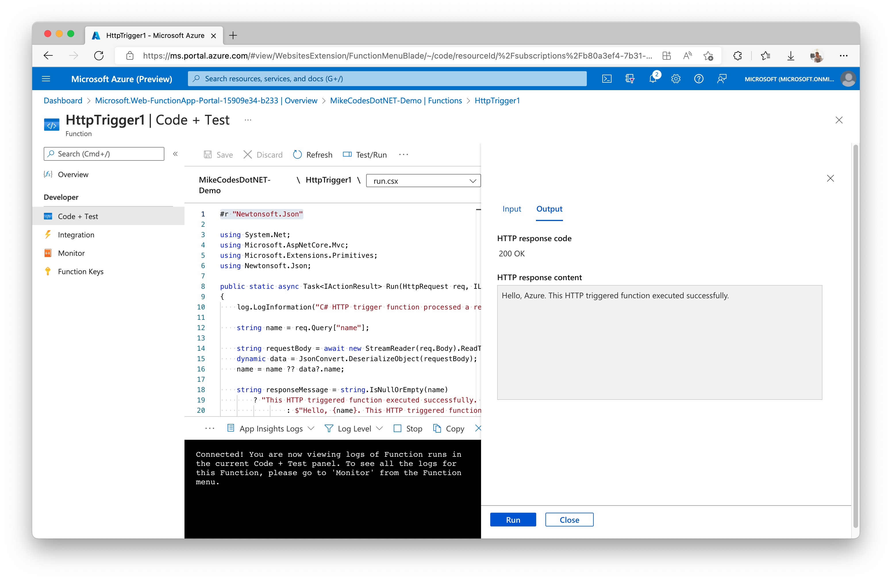

At the moment, the HTTP requires a function-specific API key to execute it as set by the [Authorisation Level](https://docs.microsoft.com/en-us/azure/azure-functions/functions-bindings-http-webhook-trigger?tabs=csharp-script%2Cfunctionsv2&pivots=programming-language-csharp#http-auth). We can change this to enable anyone to execute our function by changing it to ***Anonymous***. We do this by navigating to the Integration menu and selecting the Trigger. This will open the ***Edit Trigger*** pane which contains the Authorization Level property. 

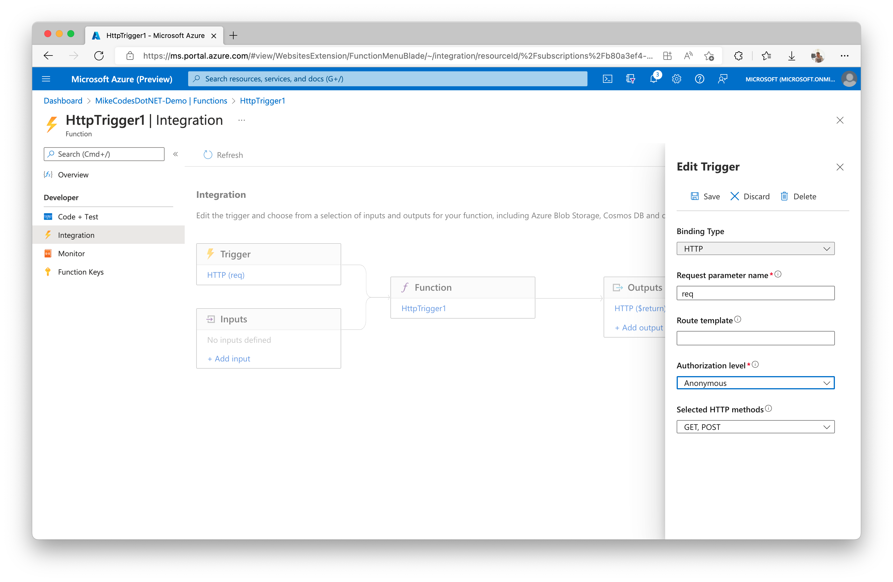

## Resources

- [Create a C# Function in Azure using Visual Studio Code](https://docs.microsoft.com/en-us/azure/azure-functions/create-first-function-vs-code-csharp?tabs=in-process)

- [Monitoring Azure Functions with Application Insights](https://docs.microsoft.com/en-us/azure/azure-functions/functions-monitoring)
